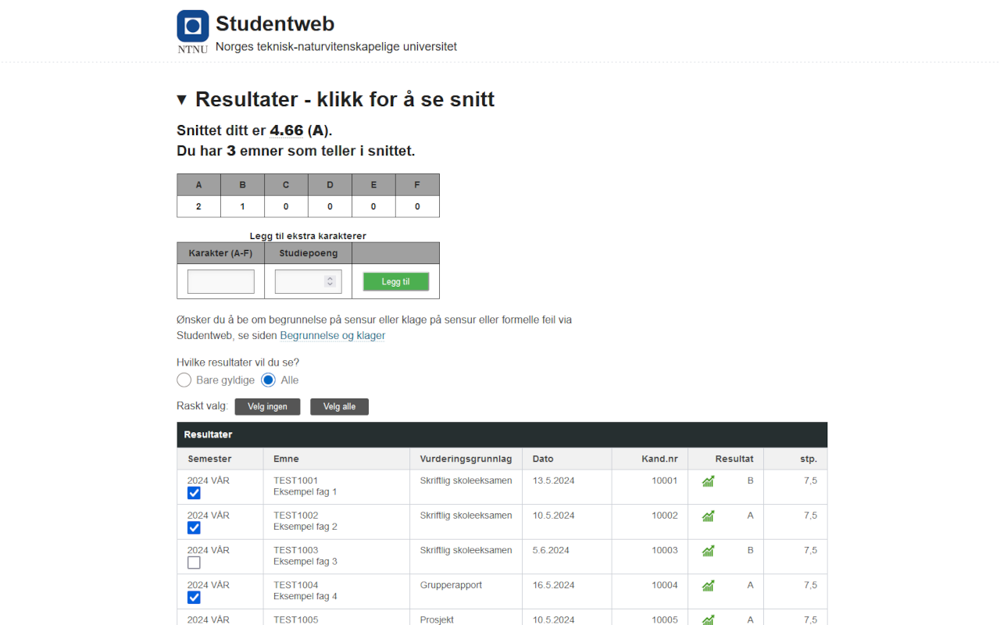

# Karaktersnitt for Studentweb

[](https://chromewebstore.google.com/detail/karaktersnitt-for-student/cnfbclbahglengpahopaafpoffahojhd)

[](https://addons.mozilla.org/addon/karaktersnitt-for-studentweb)

## Beskrivelse

Dette er en utvidelse for Firefox og Google Chrome som automatisk regner ut karaktersnittet ditt i studentweb. Det er mulig å velge hvilke emner som skal regnes med i snittet. Utvidelsen er laget for å gjøre det enklere å holde oversikt over karaktersnittet sitt, og for å slippe å regne det ut manuelt. Utvidelsen er laget for å være enkel å bruke, og for å ikke lagre noen data om brukeren.



## Installasjon

### Firefox

Last ned utvidelsen i Firefox ved å gå til [utvidelsessiden](https://addons.mozilla.org/addon/karaktersnitt-for-studentweb/). Trykk på "Add to Firefox" og følg instruksjonene. Utvidelsen vil nå være tilgjengelig i Firefox.

### Google Chrome

Last ned utvidelsen i chrome ved å gå til [utvidelsessiden](https://chromewebstore.google.com/detail/karaktersnitt-for-student/cnfbclbahglengpahopaafpoffahojhd). Trykk på "Add to Chrome" og følg instruksjonene. Utvidelsen vil nå være tilgjengelig i Chrome.

## Bruk

Utvidelsen regner automatisk ut snittet ditt når du er på "Resultater"-siden på Studentweb. Du kan velge hvilke emner som skal regnes med i snittet ved å huke av for emnene du vil ha (eller ikke) med.

## Utvikling

Utvidelsen er laget med [web-ext](https://developer.mozilla.org/en-US/docs/Mozilla/Add-ons/WebExtensions/Getting_started_with_web-ext). For å kjøre utvidelsen i utviklingsmodus, kjør `web-ext run`. For å bygge utvidelsen for produksjon, kjør `web-ext build`.

Node og npm må være installert. Se [nodejs.org](https://nodejs.org/en/download) for installasjon.

```sh
# Download dependencies
npm install --global web-ext

# Run development which reloads on file changes
web-ext run

# Check for errors/notices/warnings
web-ext lint

# Build for production
web-ext build
```
