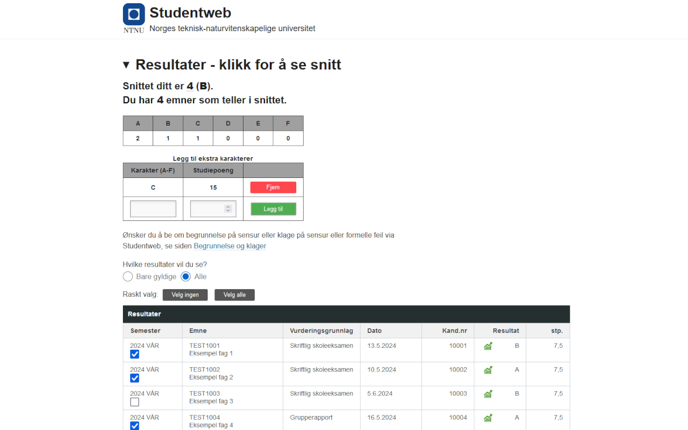

# Karaktersnitt for Studentweb

## Installasjon

| | |
|---|---|
| [](https://chromewebstore.google.com/detail/karaktersnitt-for-student/cnfbclbahglengpahopaafpoffahojhd) | [Chrome og andre Chromium nettlesere](https://chromewebstore.google.com/detail/karaktersnitt-for-student/cnfbclbahglengpahopaafpoffahojhd) |
| [](https://addons.mozilla.org/addon/karaktersnitt-for-studentweb) | [Firefox](https://addons.mozilla.org/addon/karaktersnitt-for-studentweb) |
| [](https://microsoftedge.microsoft.com/addons/detail/karaktersnitt-for-student/iffeapfmkbcceoflgkkcgoglmodjpbij) | [Microsoft Edge](https://microsoftedge.microsoft.com/addons/detail/karaktersnitt-for-student/iffeapfmkbcceoflgkkcgoglmodjpbij) |

## Beskrivelse

Dette er en utvidelse for Firefox, Google Chrome (+ andre Chromium-baserte nettlesere) og Microsoft Edge som automatisk regner ut karaktersnittet ditt i studentweb. Det er mulig å velge hvilke emner som skal/ikke skal regnes med i snittet, samt mulig å legge til nye karakterer for å se hvilke(n) karakter(er) man må ha for å få et visst snitt. Du kan også se antallet av hver karakter du har. Utvidelsen er laget for å gjøre det enklere å holde oversikt over karaktersnittet sitt, og for å slippe å regne det ut manuelt. Utvidelsen har fokus på å være enkel å bruke, og å ikke lagre noen data om brukeren.

Ingen data sendes til noen server, og ingen data lagres lokalt.



## Bruk

Utvidelsen regner automatisk ut snittet ditt når du er på "Resultater"-siden på Studentweb. Du kan velge hvilke emner som skal regnes med i snittet ved å huke av for emnene du vil ha (eller ikke ha) med.

Legg til nye karakterer ved å fylle inn karakteren og antall studiepoeng, og trykk på "Legg til". Du kan også slette karakterer ved å trykke på "Fjern" ved siden av karakteren.

## Utvikling

Gjerne lag issues eller pull requests om du savner noe funksjonalitet.

Utvidelsen er laget med [web-ext](https://developer.mozilla.org/en-US/docs/Mozilla/Add-ons/WebExtensions/Getting_started_with_web-ext). For å kjøre utvidelsen i utviklingsmodus, kjør `web-ext run`. For å bygge utvidelsen for produksjon, kjør `web-ext build`.

Node og npm må være installert. Se [nodejs.org](https://nodejs.org/en/download) for installasjon.

```sh
# Download dependencies
npm install --global web-ext

# Run development which reloads on file changes
web-ext run

# Check for errors/notices/warnings
web-ext lint -w

# Build for production
web-ext build
```
